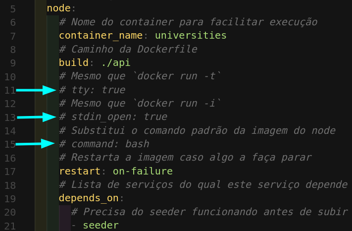
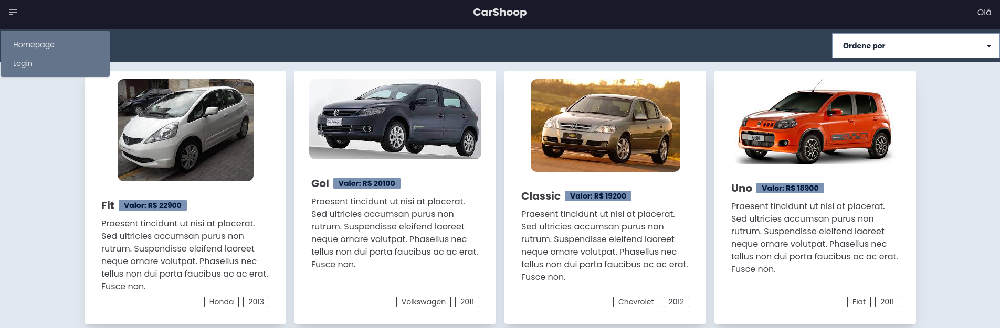
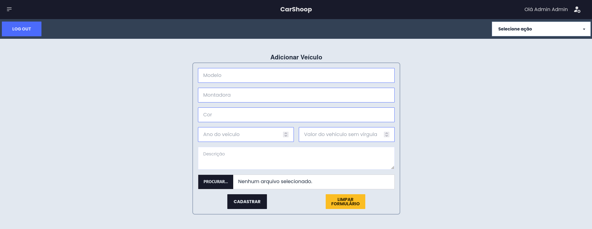
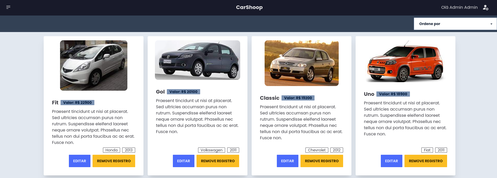

# car-shoop-verzel

Aplicação full-stack de um ecormerce de veículos.

Este projeto é resultado do desafio técnico proposto pela empresa Verzel. O desafio consistia em desenvolver uma aplicação full-stack de um ecommerce de veículos. Para isso, três serviços principais foram desenvolvidos

- Parte 1 (seeder): criar um script para fazer o carregamento inicial das informações no banco de dados.
- Parte 2 (back-end): Criar uma API que providencie um CRUD (create,‌ ‌retrieve,‌ ‌update,‌ ‌delete)‌‌ dos veículos a venda. Apenas a pessoa administradora deve conseguir adicionar, editar e remover veículos do banco de dados. Assim, uma rota de login é fornecida. Uma rota de cadastro de usuários foi contruída, mas essa ainda não foi finalizada.
- Parte 3 (front-end): Aplicação que possibilita a qualquer usuário avaliar os veículos a venda. Além disso, possibilita que usuários adiministradores cadastrados adicionem, removam ou editem a lista de veículos a venda.

O script relacionado à parte 1 do desafio se encontra no diretório **app/seeder**. Já a API que implementa o CRUD se encontra no diretório **app/back-end** e a aplicação front-end está no diretório **app/front-end**.

No restante dessa documentação são apresentadas informações como as tecnologias e arquitetura utilizadas no projeto, a documentação da API e guias de como rodar a aplicação em sua máquina.

## Rodando o Projeto na Sua Máquina

Para você rodar o projeto na sua máquina é necessário que sejam satisfeitas as seguintes condições:

- Sistema Operacional Distribuição Unix
- Node versão 16 (versão igual ou superior à `16.15.0 LTS`)
- Docker
- Docker-compose versão >=1.29.2

A seguir você encontra um guia de como instalar e rodar o projeto localmente. Em caso de dúvidas, problemas ou feedbacks, entre em contato.

**Passo 1**. Crie o repositório local utilizando `mkdir`:

```bash
mkdir car-shoop-verzel
```

**Passo 2**. Mude para o repositório criado:

```bash
cd car-shoop-verzel
```

**Passo 3**. Clone o projeto utilizando a chave SSH:

```bash
git clone git@github.com:heitortessaro/car-shoop-verzel.git
```

**Passo 4**. Mude para o diretório clonado:

```bash
cd car-shoop-verzel
```

**Passo 5**. Rode os containers da aplicação

```bash
docker-compose up -d
```

**Passo 6**. Acesse a aplicação front-end http://localhost:3008/

Ao rodar o Passo 5, as imagens relacionadas a cada um dos dockerfiles (banco de dados, back-end, seeder e front-end) serão baixadas e depois as aplicações serão inicializadas. As configurações definidas no arquivo docker-compose, presente na pasta app do projeto, estabelecem a seguinte sequência de inicialização:

- **Banco de dados**, com a porta **27017** exposta.
- **Seeder**, a aplicação é finalizada automaticamente após popular o banco de dados.
- **Back-end**, com a porta **3001** exposta.
- **Front-end**, com a porta **3008** exposta.

Caso você deseje finalizar as aplicações, basta utilizar o seguinte comando para "derrubar" os containers:

```bash
docker-compose down
```

### Rodando Testes Unitários

Testes unitários foram construídos para as camadas da arquitetura MSC (models, services e controllers) da aplicação back-end. Os testes da aplicação front-end ainda não foram desenvolvidas, mas são um ponto de melhoria do projeto. Para rodar os testes localmente é necessário que uma alteração no arquivo **docker-compose** seja realizada. Assim, abra o arquivo **docker-compose** e descomente as linhas 35, 37 e 39.



Assim, o comando _npm start_ não irá iniciar a aplicação da back-end (API) ao subir o respectivo container. No entanto, neste caso a aplicação front-end não irá funcionar enquanto os testes estiverem sendo realizados.

Feitas as alterações indicadas no arquivo **docker-compose**, é necessário que você siga os seguintes passos para rodas os testes unitários:

Passo 1. Rode os containers da aplicação:

```bash
docker-compose up -d
```

Passo 2. Rode o seguinte comando para acessar o terminal do container com a aplicação da API.

```bash
docker exec -it back-end bash
```

Passo 3. Por precaução, certifique-se de que as dependências estão instaladas, rodando:

```bash
npm install
```

Passo 4. Rode o comando que executa os testes unitários:

```bash
npm run test:dev
```

Os testes devem ser executados e os resultados apresentados no próprio terminal.

**Importante!** lembre-se de comentar as linhas 35, 37 e 39 após finalizar a análise dos testes da aplicação.

## Como utilizar a aplicação

Após rodar o projeto na sua máquina e acessar o endereço da aplicação front-end (http://localhost:3008/) você irá se deparar com a home do projeto. Aqui você pode acessar o menu de opções com o ícone superior esquerdo, que possibita realizar o login na aplicação. Além disso, existe um seletor que possibilita ao usuário alterar a ordem de apresentação dos vehículos a venda.



Para realizar o login na aplicação e ter acesso as opções de adição, atualização e remoção de veículos a venda, selecione Login no menu superior esquerdo. Para acessar utilize a seguinte conta:

```bash
e-mail: admin@admin.com
senha: admin-password
```

Após realizar o login, você será redirecionado para a de adimistrador, onde é possível:

- Realizar o Log out (botão canto superior esquedo).
- Selecionar entre as opções de adição ou atualização de registro (seletor canto superior direito).
- Acessar a tela de administrado (tela atual) utilizando o ícone do canto superior direito.
- Retornar à home clicando sobre o logo CarShop no top da tela.
- Adicionar o registro de um novo veículo.



Ao retornar a tela home após realizar o o login, você verá que cada card irá apresentar duas opções novas: 1) Editar; 2) Remover Registro.

Ao selecionar a opção editar, você será redirecionado à tela de administrados e o formulário já contará com as informações do veículo que você selecionou. Você poderá então, atualizá-las e selecionar a opção de atualizar registro.

Ao selecionar a opção Remover Registro, um pop-up será apresendado pedindo confirmação antes de realizar a remoção do registro do banco de dados.



## Tecnologias utilizadas

Na sequeência são listadas as principais tecnologias utilizadas para a implementação do projeto. Inicialmente são apresentadas as utilizadas para o desenvolvimento da aplicação back-end:

- [Express](https://expressjs.com/): web framework para construir APIs com Node.js.
- [Mongoose](https://mongoosejs.com): é uma biblioteca JavaScript com orientação a objetos que cria uma conexão entre o banco de dados MongoDb e uma aplicação com Node.js.
- [TypeScript](https://www.typescriptlang.org): é um superset do JavaScript que adiciona tipagem estática à linguagem.
- [Zod](https://www.npmjs.com/package/zod): é uma biblioteca para validação de dados.
- [Helmet](https://geopy.readthedocs.io/en/stable/index.html?highlight=geodesic#): é uma biblioteca para aprimorar a segurança de aplicações criadas em Express que adiciona HTTP header à aplicação.
- [Cors](https://www.npmjs.com/package/cors): é um pacote Node.js que prove um middleware utilizado para habilitar CORS (Cross-Origin Resource Sharing).
- [ESLint](https://eslint.org/) para padronização do código.
- [jsonwebtoken](https://www.npmjs.com/package/jsonwebtoken) uma implementação do JSON Web Tokens.
- [bcryptjs](https://www.npmjs.com/package/bcryptjs): para converter as senhas dos usuários em hash antes de salvar no banco de dados.
- [multer](https://www.npmjs.com/package/multer): é um middleware node.js para trabalhar com multipart/form-data, geralmente ligado ao upload de arquivos.

Para a aplicação front-end foram utilizadas:

- [vite](https://vitejs.dev/): Ferramenta para desenvolvimento de projetos web. Ela torna a criação e o build dos projetos React muito mais rápidos.
- [react](https://reactjs.org/): Biblioteca JavaScript para constuções de aplicações web front-end mais utilizada no mundo.
- [react-hook-form](https://react-hook-form.com/): Hook personalizada para criação e validação de formulários em aplicações React.
- [Redux Toolkit](https://redux-toolkit.js.org/): Ferramenta que facilita e deixa a utilização de Redux mais simplificada na gestão de estados globais em aplicações React.
- [tailwindcss](https://tailwindcss.com/): Framework CSS que prove uma série de classes para realizar a estilização de componentes de forma mais prática.
- [daisyui](https://daisyui.com/): Biblioteca de componentes open-source baseada no Framework CSS Tailwind.
- [axios](https://axios-http.com/docs/intro): Axios é um cliente HTTP baseado em promisses para aplicações com node.js e no navegador. Utilizada para realizar as requisições à API provida pela aplicação back-end.
- [jwt-decode](https://www.npmjs.com/package/jwt-decode): Decodifica o conteúdo do token JWT.
- [ESLint](https://eslint.org/) para padronização do código.

Para a implementação dos testes unitários foram utilizadas:

- [Mocha.js](https://mochajs.org/): é um framework JavaScript para criar testes assíncronos.
- [Sinon.js](https://sinonjs.org/): utilizado para realizar o stub de funções.
- [Chai](https://www.chaijs.com/): é uma biblioteca de asserção, que torna os testes mais legíveis.

Para a implementação do banco de dados se utilizou o [MongoDB](https://www.mongodb.com/), o qual rodou a partir de um container local. Todavia, outra opção é utilizar o serviço [Atlas](https://www.mongodb.com/atlas).

## Documentação da API - **ainda não disponível**

A documentação da API foi construída utilizando a ferramenta Postman. Você pode acessar a última versão através deste [link](). Na documentação você tem acesso a todas as rodas, bem como a exemplos de requisições a cada rota.

## Organização e Arquitetura

A aplicação tentou aplicar a filosofia **SOLID** em conjunto com a arquitetura **MSC** e **orientação a objetos**. Assim, interfaces foram utilizadas para contruir a abstração da aplicação e garantir a inversão de dependências. Ademais, arquivos relacionados ao model (M) tem por objetivo possibilitar a conexão e interação com o banco de dados, já arquivos do service (S) performam ações de validação das regras de negócio e validação e, por fim, arquivos relacionados ao controller (C) se destinam a fazer a interface com as requisições externas a aplicação. Essa segregação é mais fácil observada analisando a estrutura da API apresentada a seguir:

### Back-End

```
📦src
┣ 📂controllers
┃ ┣ 📜User.ts
┃ ┗ 📜Vehicle.ts
┣ 📂errors
┃ ┗ 📜catalog.ts
┣ 📂interfaces
┃ ┣ 📜ILogin.ts
┃ ┣ 📜IModel.ts
┃ ┣ 📜IModelUser.ts
┃ ┣ 📜IRequestMulter.ts
┃ ┣ 📜IRequestWithHeader.ts
┃ ┣ 📜IServiceUser.ts
┃ ┣ 📜IServiceVehicle.ts
┃ ┣ 📜IUser.ts
┃ ┗ 📜IVehicle.ts
┣ 📂middleware
┃ ┣ 📜authentication.ts
┃ ┗ 📜error.ts
┣ 📂models
┃ ┣ 📜MongoModels.ts
┃ ┣ 📜User.ts
┃ ┣ 📜Vehicles.ts
┃ ┗ 📜connections.ts
┣ 📂routes
┃ ┣ 📜User.ts
┃ ┗ 📜Vehicle.ts
┣ 📂services
┃ ┣ 📜HashPassword.ts
┃ ┣ 📜JWT.ts
┃ ┣ 📜User.ts
┃ ┗ 📜Vehicle.ts
┣ 📂tests
┃ ┣ 📂mocks
┃ ┃ ┣ 📜userMocks.ts
┃ ┃ ┗ 📜vehicleMock.ts
┃ ┗ 📂units
┃ ┃ ┣ 📂controllers
┃ ┃ ┃ ┗ 📜vehicle.test.ts
┃ ┃ ┣ 📂models
┃ ┃ ┃ ┣ 📜user.test.ts
┃ ┃ ┃ ┗ 📜vehicle.test.ts
┃ ┃ ┗ 📂services
┃ ┃ ┃ ┣ 📜users.test.ts
┃ ┃ ┃ ┗ 📜vehicles.test.ts
┣ 📜app.ts
┗ 📜index.ts
```

### Seeder

```
📦src
┣ 📂data
┃ ┣ 📜user.js
┃ ┗ 📜vehicles.js
┣ 📂helpers
┃ ┗ 📜encriptPassword.js
┣ 📂models
┃ ┣ 📜User.js
┃ ┣ 📜Vehicle.js
┃ ┗ 📜connections.js
┣ 📜index.js
┗ 📜seeder.js
```

### Front-End

```
📦src
 ┣ 📂components
 ┃ ┣ 📂adminBar
 ┃ ┃ ┗ 📜AdminBar.jsx
 ┃ ┣ 📂cardVehicle
 ┃ ┃ ┗ 📜CardVehicle.jsx
 ┃ ┣ 📂deleteConfirmationModal
 ┃ ┃ ┗ 📜DeleteConfirmationModal.jsx
 ┃ ┣ 📂footer
 ┃ ┃ ┗ 📜Footer.jsx
 ┃ ┣ 📂navbar
 ┃ ┃ ┗ 📜Navbar.jsx
 ┃ ┗ 📂selectBar
 ┃ ┃ ┗ 📜SelectBar.jsx
 ┣ 📂features
 ┃ ┣ 📂store
 ┃ ┃ ┗ 📜store.js
 ┃ ┣ 📂user
 ┃ ┃ ┣ 📂actions
 ┃ ┃ ┃ ┗ 📜loginUser.js
 ┃ ┃ ┗ 📜userSlice.js
 ┃ ┗ 📂vehicles
 ┃ ┃ ┣ 📂actions
 ┃ ┃ ┃ ┣ 📜deleteVehicle.js
 ┃ ┃ ┃ ┣ 📜getvehicles.js
 ┃ ┃ ┃ ┣ 📜saveVehicle.js
 ┃ ┃ ┃ ┗ 📜updateVehicle.js
 ┃ ┃ ┗ 📜vehiclesSlice.js
 ┣ 📂pages
 ┃ ┣ 📂controlForm
 ┃ ┃ ┗ 📜ControlForm.jsx
 ┃ ┣ 📂home
 ┃ ┃ ┗ 📜Home.jsx
 ┃ ┗ 📂login
 ┃ ┃ ┗ 📜Login.jsx
 ┣ 📜App.css
 ┣ 📜App.jsx
 ┣ 📜index.css
 ┗ 📜main.jsx
```

## Materiais Utilizados

- [Validação imagens zod](https://stackoverflow.com/questions/72674930/zod-validator-validate-image). Não mais utilizado.

- [Upload de imagem no back-end](https://www.youtube.com/watch?v=srPXMt1Q0nY).

- [Seeder no MongoDB com Mongoose](https://www.youtube.com/watch?v=SRBLmyeUFFI).

- [React-hook-form guide](https://blog.logrocket.com/react-hook-form-complete-guide/)

## Futuras Melhorias

- Remover a imagem quando o registro é removido ou atualizado;
- Adicionar a funcionalidade do multer a rota de atualização;
- Reavaliar os testes desenvolvidos para o back-end (ao desenvolver a aplicação front-end, algumas alterações foram realizadas no back-end e os efeitos nos testes não foram verificados);
- Dar a opção ao usuário de não precisar carregar a imagem ao atualizar o registro.
- Dar a opção ao usuário de carregar múltiplas imagens e gerar um carossel na aplicação front-end.
- Ao atualizar o registro remover a imagem antiga se ela foi alterada;
- Opção para adicionar, atualizar, buscar e deletar usuários;

## O que eu utilizei de novo nesse projeto

Nesse projeto utilizei pela primeira vez a biblioteca axios. Fiz isso, pois percebo que ela é muito utilizada no mercado e queria verificar se ela seria melhor que o fetch existente no JavaScript. O seu uso para criação de requisições parece simplificar o processo.

Essa também foi a primeira vez que utilizei a biblioteca multer. Bem como fiz o envio de imagens a partir da aplicação front-end.

Ainda em relação a aplicação front-end, essa foi a primeira vez que utilizei o vite para gerar o projeto. Acredito que ele apresenta um ganho significativo em relação ao tempo de criação e build, sendo algo que vou adotar para projetos futuros. Também foi meu primeiro contato com o react-hook-form e devo dizer que torna o trabalho com formulários muito mais simples.
